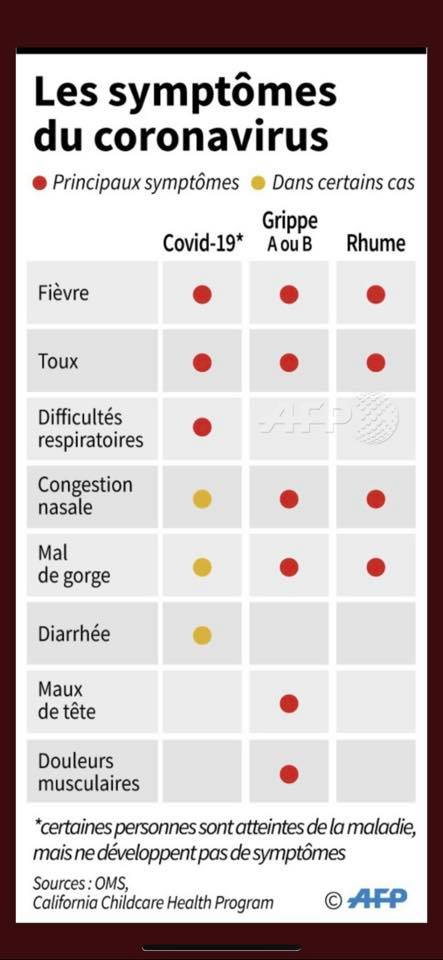

+++
fragment = "content"
weight = 100
#background = ""
categories = ["coronavirus"]

title = "Symptomes du Coronavirus"
#subtitle = ""
title_align = "left"

display_date = true
date = "2020-03-19"

summary = """
Vous trouverez tous les symptômes du Coronavirus en comparaison de la grippe et du rhume.
"""
    
[sidebar]
  align = "right"

[asset]
  image = "image.png"
  
+++

