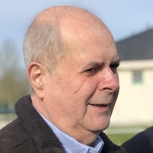

+++
fragment = "content"
weight = 100
[sidebar]
  sticky = true
+++

Je suis retraité de l’industrie électronique aéronautique.

Ingénieur automaticien de formation, j’ai exercé l’essentiel de ma carrière dans une entreprise spécialisée dans 
l’industrie électronique aéronautique où j’ai occupé différents postes à responsabilités dont celui de responsable de 
projets industriels.

Ma famille maternelle Villeret, est originaire du sud lochois et présente depuis des siècles avec comme berceau ; 
Preuilly-sur-Claise, Charnizay, Bossay sur Claise, Tournon Saint Pierre et bien d’autres communes limitrophes.

J’ai quitté Paris où j’ai vécu et travaillé pendant plusieurs décennies pour venir vivre à Preuilly-sur-Claise dans un 
écrin de verdure. Ce cadre de vie, que beaucoup nous envient, nous devons le protéger et le faire évoluer sans le dénaturer.

Mes douze années passées à travailler au sein du conseil municipal et de la communauté de communes, et ma présence 
dans de nombreuses commissions, ainsi que dans les associations prouvent mon engagement dans la vie communale.

Je souhaite poursuivre ce travail aux côtés d’une équipe d’anciens et de nouveaux collègues, tous engagés et motivés 
pour continuer à faire rayonner notre belle commune de Preuilly-sur-Claise.
