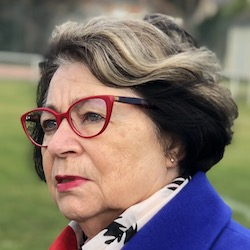

+++
fragment = "content"
weight = 100
[sidebar]
  sticky = true
+++

Je suis née à Tours et y ai vécu 60 ans.

J'ai travaillé 7 ans en tant que secrétaire dans une société de charbonnage SOTOMACO, je me suis arretée 2 ans puis je me suis recyclée dans la petite enfance en travaillant pendant 25 ans à la crèche du CHR TOURS. 

Après un premier mandat, j'ai envie de poursuivre mon engagement afin d'améliorer mes connaissances sur la commune et participer aux diverses manifestations.

Mon engagement est de mettre l'intérêt général en avant, faire le mieux possible en travaux d'investissement pour dynamiser la commune et faire vivre Preuilly.

Cela suppose une gestion serrée des dépenses de fonctionnement en raison des moyens limités du budget communal.

Ma crainte est qu'aujourd'hui notre commune perde des compétences au bénéfice de l'intercommunalité.
