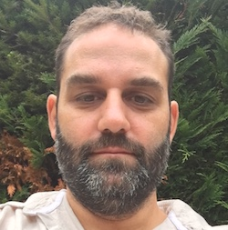

+++
fragment = "content"
weight = 100
[sidebar]
  sticky = true
+++

Expert dans les technologies, je travaille actuellement pour le Ministère de la Défense : Je participe notamment au développement d'un logiciel déployé dans le monde et utilisé par les Forces Spéciales françaises. Mon activité m'amène également à aider les petites, moyenne et grandes entreprises (Enedis, Société générale, MMA, ...) à trouver des solutions innovantes pour améliorer leur fonctionnement quotidien. Et pour cela, mon expérience parle mieux que mes diplômes.

Arrivé à Preuilly par les hasards des mutations de ma femme, Principale du réseau des collèges, nous avons depuis été pris d'un réel amour pour notre merveilleuse ville.

Totalement intégrés ma famille et moi, nous nous sommes investis petit à petit dans la communauté, grâce notamment :
* aux rencontres que nous avons eues,
* à toutes les associations proposant tant d'activités,
* mais aussi la municipalité actuelle.
  
J'ai poursuivi cet engagement en tant que Secrétaire de l'APE du collège Gaston Defferre, en ouvrant un espace d'expertise en informatique à Preuilly et, aujourd'hui, en proposant mon expertise dans le monde économique, organisationnel et digital à la municipalité.

J'aime l'approche de notre liste **Unis pour Preuilly** qui a cherché à rassembler : 
* les listes autrefois éclatées,
* mais aussi des personnes aux parcours aussi différents que riches pour offrir leurs savoir-faire à nous tous.

Je ne crois et n'ai jamais cru aux luttes politiques. Seul le bon sens prévaut pour le bien de tous.

