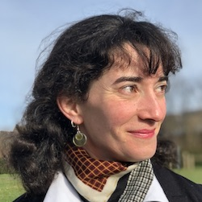

+++
fragment = "content"
weight = 100
[sidebar]
  sticky = true
+++

J'ai grandi à Preuilly-la-ville, mais c'est le charme et les attraits de Preuilly-sur-Claise, où ma mère a enseigné pendant une dizaine d'années, qui m'ont incité à m'y établir en 2017.

Après avoir travaillé en tant que professeure d'anglais en France et à l'étranger, j'ai préféré participer à la vie de notre village et en particulier à celle du marché hebdomadaire.

Pour moi l'avenir est à la décroissance et au renouement avec la vie locale, c'est pourquoi je crois au potentiel de Preuilly : du bio à portée de mains, des transports en commun, et la possibilité de participer à une vie associative riche... 

Nous avons tout ici !
