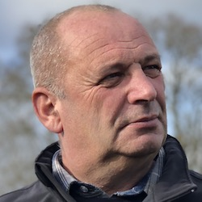

+++
fragment = "content"
weight = 100
[sidebar]
  sticky = true
+++

Enfant du pays, notre nom résonne depuis plus de 5 générations dans la région à travers notamment l'entreprise 
familiale de couverture transmise de père em fils.

Actif dans la vie de Preuilly à travers mes engagements dans le commité des fêtes, ma présidence de la MCJ à une période
où elle a failli être dissoute, j'aime aider et transmettre. 

C'est pourquoi je me suis engagé en tant que pompier volontaire, puis je me suis chargé des recrutements de jeunes 
sapeur-pompiers et enfin la formation de ces jeunes à travers la discipline qu'exige cette fonction.

J'aime ma ville et ses habitants et, même si nous ne sommes pas toujours d'accord, mes 2 mandats en tant que conseiller
municipal a toujours été pour aider au meilleur fonctionnement de notre ville.

Je remercie ma femme Florence et mes enfants pour leur accompagnement et leur soutient indéfectible dans tous les 
engagements que j'ai pu prendre au cours de ma vie et particullièrement pour ce rôle de conseiller auquel je me présente.  
