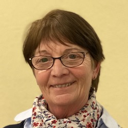

+++
fragment = "content"
weight = 100
[sidebar]
  sticky = true
+++

Je suis native des Hauts de France et retraitée du secteur médical privé : en fin de carrière, mon mari et moi avons décidé de nous installer à Preuilly, où depuis 10 ans nous vivons pleinement notre retraite.

Nous avons été sensibles à l’accueil chaleureux des habitants. J’ai donc eu très vite envie de m'investir dans la vie de notre communauté !

Je suis notamment élue, adjointe au Maire depuis 6 ans, avec une attention particulière portée au domaine social et à l’enfance. Je consacre également beaucoup d’énergie aux événements et aux activités culturelles, sans compter la participation aux commissions de la communauté de communes où je représente régulièrement Preuilly.

Je suis passionnée par ces missions et j'ai envie de continuer à m’investir, communiquer et rester proche des habitants afin de répondre à leurs attentes.

