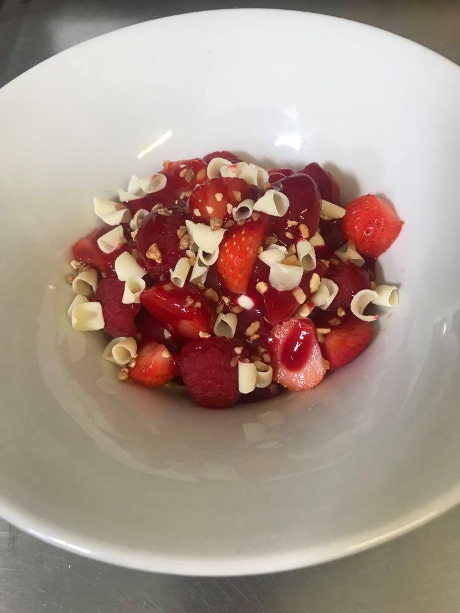
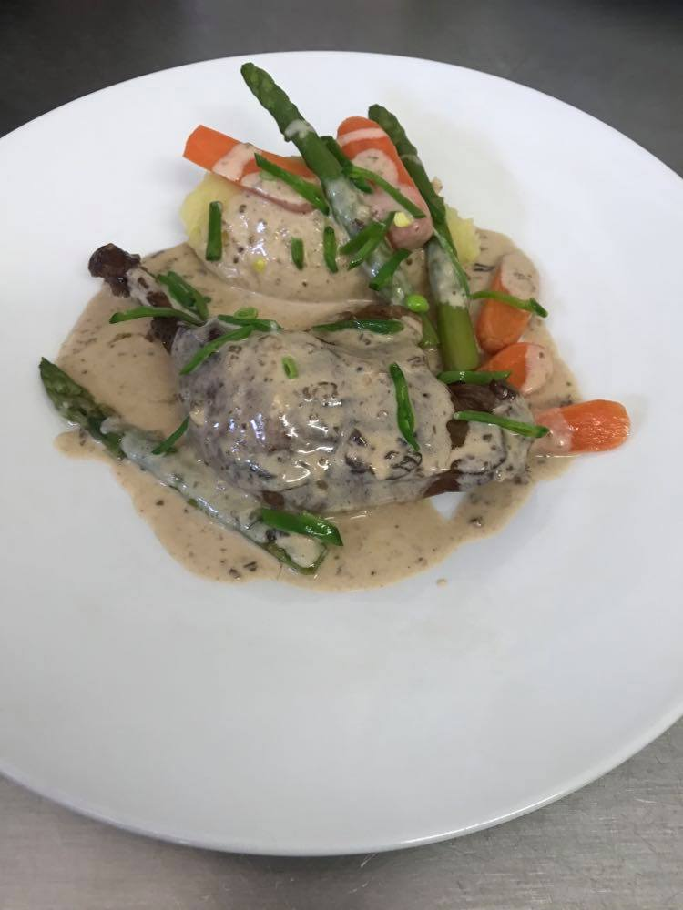

+++
fragment = "content"
weight = 100
#background = ""
categories = ["commerce"]

title = "Menu de la Claise du 1er Mai"
#subtitle = ""
title_align = "left"

summary = "Menu de la Claise du 1er Mai"

[sidebar]
  align = "right"

[asset]
  image = "foi_gras.jpg"
  
+++

Menu du 1er Mai (Commandes prises jusqu'au 29 avril) :

* Entrée : Tarte aux crabes et crevettes, brochette de gambas, tomates et avocat
* Plat : Noix de dinde fondante sauce au foie gras poêlées de carottes, asperges vertes et pommes de terre
* Dessert : Fraîcheur autour de la fraise, mousse tagada, crumble aux amandes servie en verrine

Prix :

* Le Menu complet: 22€
* A la carte 
    * Entrée : 7€
    * Plat : 11€
    * Dessert : 4€

Il est possible également d'acheter du foi gras :

* 1kg 80€ 
* 100g 8€

Tel : <a href="02 47 92 08 50">02 47 92 08 50</a>
 
Quelques images pour vous rappeler ce lointain souvernir où nous mangions au restaurant des plats si succulents.

